# LuvStories - Private Relationship Intelligence

<p align="center">
  <picture>
    <source media="(prefers-reduced-motion: reduce)" srcset="assets/hero/hero-reduced.svg">
    <source media="(prefers-color-scheme: light)" srcset="assets/hero/hero-light.svg">
    
  </picture>
</p>

<p align="center">
  <picture>
    <source media="(prefers-reduced-motion: reduce)" srcset="assets/hero/computational-dark.svg">
    <source media="(prefers-color-scheme: light)" srcset="assets/hero/computational-light.svg">
    
  </picture>
</p>

LuvStories is a private relationship intelligence platform that helps users build, understand, and shape their love stories through private workspaces.

## Features

- Private story workspaces
- Relationship timeline tracking
- Secure notes and reports
- Relationship scoring system
- End-to-end encryption support
- Privacy-first architecture

## Setup

1. Clone the repository
2. Install dependencies:

```bash
npm install
```

3. Create a `.env` file with the following variables:

```bash
NEXT_PUBLIC_SUPABASE_URL=your-supabase-url
NEXT_PUBLIC_SUPABASE_ANON_KEY=your-supabase-anon-key
NEXT_PUBLIC_ENCRYPTION_SECRET=your-encryption-secret
```

4. Run the SQL migrations in your Supabase database:

```sql
-- Run the migrations from migrations/20240408000000_create_private_tables.sql
```

5. Start the development server:

```bash
npm run dev
```

## Database Schema

The application uses the following tables:

- `stories`: Main story workspaces
- `story_profiles`: Relationship profiles
- `story_events`: Timeline events
- `story_notes`: Private notes
- `story_scores`: Relationship scores
- `story_reports`: Generated reports

All tables are protected by Row Level Security (RLS) and can only be accessed by the owning user.

## Deployment

The easiest way to deploy is using Vercel:

```bash
vercel deploy
```

## Security

The application includes:
- Row Level Security on all tables
- Optional end-to-end encryption for sensitive data
- Secure authentication flow
- Privacy-first architecture

All user data is private and never shared.

<!-- TRILLIONX:presentation:begin -->

### Animated surfaces

Generated from this repository's own source tree: every count, route and module below was measured, not written by hand.

#### Identity

<picture>
  <source media="(prefers-reduced-motion: reduce)" srcset="https://raw.githubusercontent.com/M4G3LL4N0/luvstories/main/.github-art/surfaces/hero-reduced.svg">
  <source media="(prefers-color-scheme: light)" srcset="https://raw.githubusercontent.com/M4G3LL4N0/luvstories/main/.github-art/surfaces/hero-light.svg">
  
</picture>

#### Entry points

<picture>
  <source media="(prefers-reduced-motion: reduce)" srcset="https://raw.githubusercontent.com/M4G3LL4N0/luvstories/main/.github-art/surfaces/terminal-reduced.svg">
  <source media="(prefers-color-scheme: light)" srcset="https://raw.githubusercontent.com/M4G3LL4N0/luvstories/main/.github-art/surfaces/terminal-light.svg">
  
</picture>

#### Modules

<picture>
  <source media="(prefers-reduced-motion: reduce)" srcset="https://raw.githubusercontent.com/M4G3LL4N0/luvstories/main/.github-art/surfaces/architecture-reduced.svg">
  <source media="(prefers-color-scheme: light)" srcset="https://raw.githubusercontent.com/M4G3LL4N0/luvstories/main/.github-art/surfaces/architecture-light.svg">
  
</picture>

#### Routes

<picture>
  <source media="(prefers-reduced-motion: reduce)" srcset="https://raw.githubusercontent.com/M4G3LL4N0/luvstories/main/.github-art/surfaces/data_flow-reduced.svg">
  <source media="(prefers-color-scheme: light)" srcset="https://raw.githubusercontent.com/M4G3LL4N0/luvstories/main/.github-art/surfaces/data_flow-light.svg">
  
</picture>

#### Primitives

<picture>
  <source media="(prefers-reduced-motion: reduce)" srcset="https://raw.githubusercontent.com/M4G3LL4N0/luvstories/main/.github-art/surfaces/state_machine-reduced.svg">
  <source media="(prefers-color-scheme: light)" srcset="https://raw.githubusercontent.com/M4G3LL4N0/luvstories/main/.github-art/surfaces/state_machine-light.svg">
  
</picture>

#### Composition

<picture>
  <source media="(prefers-reduced-motion: reduce)" srcset="https://raw.githubusercontent.com/M4G3LL4N0/luvstories/main/.github-art/surfaces/component_map-reduced.svg">
  <source media="(prefers-color-scheme: light)" srcset="https://raw.githubusercontent.com/M4G3LL4N0/luvstories/main/.github-art/surfaces/component_map-light.svg">
  
</picture>

#### Build and tests

<picture>
  <source media="(prefers-reduced-motion: reduce)" srcset="https://raw.githubusercontent.com/M4G3LL4N0/luvstories/main/.github-art/surfaces/build-reduced.svg">
  <source media="(prefers-color-scheme: light)" srcset="https://raw.githubusercontent.com/M4G3LL4N0/luvstories/main/.github-art/surfaces/build-light.svg">
  
</picture>

#### Workflow

<picture>
  <source media="(prefers-reduced-motion: reduce)" srcset="https://raw.githubusercontent.com/M4G3LL4N0/luvstories/main/.github-art/surfaces/workflow-reduced.svg">
  <source media="(prefers-color-scheme: light)" srcset="https://raw.githubusercontent.com/M4G3LL4N0/luvstories/main/.github-art/surfaces/workflow-light.svg">
  
</picture>

#### Domain

<picture>
  <source media="(prefers-reduced-motion: reduce)" srcset="https://raw.githubusercontent.com/M4G3LL4N0/luvstories/main/.github-art/surfaces/domain-reduced.svg">
  <source media="(prefers-color-scheme: light)" srcset="https://raw.githubusercontent.com/M4G3LL4N0/luvstories/main/.github-art/surfaces/domain-light.svg">
  
</picture>

#### Identity object

<picture>
  <source media="(prefers-reduced-motion: reduce)" srcset="https://raw.githubusercontent.com/M4G3LL4N0/luvstories/main/.github-art/surfaces/footer-reduced.svg">
  <source media="(prefers-color-scheme: light)" srcset="https://raw.githubusercontent.com/M4G3LL4N0/luvstories/main/.github-art/surfaces/footer-light.svg">
  
</picture>

<!-- TRILLIONX:presentation:end -->

<!-- TRILLIONX:evidence:begin -->

## What is measurable here

Generated by `.github-art` from the source tree at publish time.

| Signal | Value |
| --- | --- |
| HTTP routes | 20 |
| Entry points | 1 |
| Module roots | 4 |
| Test files | 0 |
| CI workflows | 0 |
| Distinctive stack | Supabase, Zod |
| Status | PROTOTYPE |
| Evidence confidence | E3 |
| Animated surfaces | 10 |

<!-- TRILLIONX:evidence:end -->
